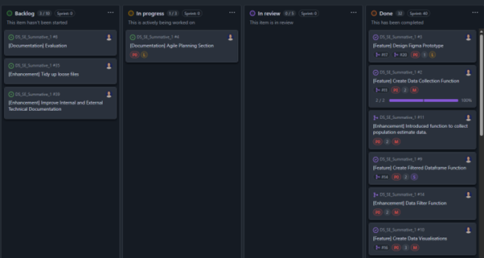
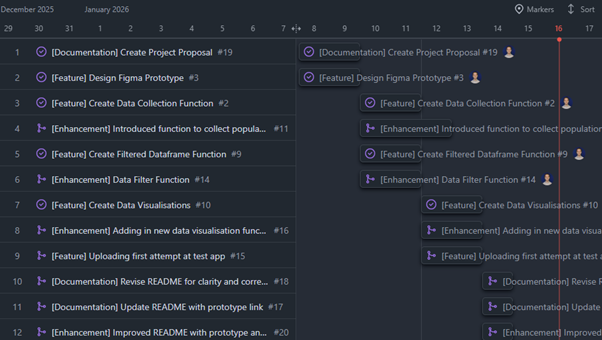

# Data Science Software Engineering Summative 1 Assignment
This repository contains all the files and information relevant to my Summative 1 assignment for the Software Engineering module.

## Project Proposal
The proposal for this project is to create a useful data product. Specifically, this product will use a Python file, which connects to the Office for National Statistics (ONS) NOMIS web API to collect UK regional population estimates, and convert this data into three standardised, publication ready charts to be deployed onto Streamlit as an online application. 

The charts selected to be included in this product will be a bar chart displaying the population of each region within the United Kingdom using data from 2023, a pie chart displaying the population breakdown of each region in 2024, and a second bar chart highlighting the percentage change in each region between 2023 and 2024.

The NOMIS API is particularly relevant to my workplace, as colleagues have recently begun to utilise this API and NOMIS datasets. Therefore, this product is highly relevant and may act as an introduction to senior stakeholders and decisions makers about the usefulness and potential of this data.


## Design and Prototype
The NOMIS Population Estimates prototype is available [here]( https://www.figma.com/design/mkHJsps61uHcKIPIVSwEMh/SE_Summative_1?node-id=3-252&t=jPzamB5Tra5ZRfd9-1). 

The initial concept for this application was based on a Tkinter Python application (see Desktop_App page within Figma). This model used four separate frames for the Landing Page, Bar Chart, Pie Chart, and Percentage Change Chart. These pages use an embedded PNG file exported from the Jupyter notebook, including the 2023 Regional Breakdown bar chart, 2024 Regional Breakdown pie chart, and percentage point change in population share from 2023 to 2024. Additionally, each of the buttons within the prototype are wired to allow the user to click through the fully functional prototype.

The design of the original prototype also utilised user feedback. This was captured through a google form containing questions around key design features and was distributed to the five other members within my team. The resulting changes included a rework of the “% Change Chart” name to “Percentage Change Chart”, and a visible button to export/print each page. This contribution helped to integrate user feedback and improved the overall prototype by aligning the prototype more closely with stakeholder expectations and made the application more user-friendly.

However, following further research into the project requirements, the prototype was refocused to reflect a Python Streamlit web application that could be deployed, better representing a realistic software engineering product. The updated design (see Desktop_App_v2 page within Figma) consisted of individual tabs, rather than separate pages, and carried forward the revised labelling and export action, and presented a cleaner, web focused interface. 


An example of the google form used to collect user feedback can be found [here]( https://forms.gle/bS94FHrxhvVtbxLJA).


## Plan
This section outlines the planning approach used throughout the project. The Agile method was selected as the full set of requirements was not fully defined at the outset. Instead, the initial goal was to retrieve population data from the NOMIS API, create several data visualisations, and deploy them within an app. Using the Agile method benefitted me during this project as I was able to pivot from creating a Tkinter app to deploying an online Streamlit app, when it became more suitable.

Once I had decided on the project method, I created a new GitHub project to manage and record all my issues. Specifically, I chose to use a Kanban board to track the progression of every issue and pull request. The columns utilised the most included the Backlog, In Progress, and Done columns. The In Review column was retained in the project but was not used as I was the only developer in this project. In future, if I was to work collaboratively with a colleague in similar software development, this section would house latest developments prior to final sign-off.

An example of the Kanban board used can be found below, clearly demonstrating the tasks/issues which remain untouched in the backlog, the issue currently being worked on as in progress, and the stack of issues which are now closed and completed. An additional benefit of utilising GitHub projects is the ability to mark the priority, estimated size, and sprint of each individual issue which can also be seen in the screenshot. The following screenshot then shows the progression of this documentation ticket once it hd been completed.




As I was following Agile methodology, I split my project into several individual sprints. Sprint 1 covered issues such as “Create Project Proposal” and “Design Figma Prototype” which were tasks which could be picked up early in the project. Future sprints often then build on and enhanced work committed in earlier sprints, such as the “Create Data Visualisations” from Sprint 3 which built on the work committed by “Create Filtered Dataframe Function” from Sprint 2. By doing this, the work was developed iteratively in smaller sections, rather than in a handful of commits involving significant levels of code. This made testing and successful implementation easier. 

In addition to the Kanban board, I also heavily utilised the Roadmap tab within Github projects. This helped me visualise exactly which tasks fell into which sprint, and the specific days in which I aimed to complete each specific task to stay on track. A screenshot of the roadmap demonstrating distinct sprints can be seen below.



By the end of the project, I was far more experienced using GitHub to record my developments and progress. This is reflected in the renaming, expanding or merging of old commits and issues, which evolved into more comprehensive and substantial items that better represented meaningful development work.


## Build
The development of the final app was iterative and evolved over time. Initially, I designed the app to run off a Python Jupyter notebook. This can be found in the archive folder under `Summative_1_notebook.ipynb`. The first development was the creation of the NOMIS population estimates API function `fetch_population_data`. This was specifically designed to extract data for a defined year, as an absolute value rather than percentage, for combined gender, and individuals ages 16-64. These parameters were selected to mirror similar analysis to those within my workplace.

Once the data collection was working, I developed the `filter_population_df` function to filter and clean the extracted data into only that which would be needed for the data visualisations. This produced two useful dataframes “filtered_df_23” and “filtered_df_24”, which were ready to be used within a visual.

Three matplotlib visualisation functions were then created, and included:
-	A bar chart showing regional population estimates for 2023.
-	A pie chart showing regional population estimates for 2024.
-	A bar chart showing the percentage point changes in population share by region between 2023 and 2024.

After each of my functions had been created and successfully ran, I created a prototype application using Tkinter. The code for this can be found within the `test_app.ipynb` within the archive folder. However, this app did not leave the prototype stage as I deemed it unsuitable and instead pivoted towards the creation of a deployed Streamlit app. This had several benefits, such as allowing a user to view the visuals using a web browser and was more closely related to software development than the original Jupyter notebook. 

To produce this app, I transferred my code from the Jupyter notebook to a Python file, which is the format required for deployment on Streamlit. I researched Streamlit best practices and made several improvements to ensure the app behaved correctly when re-run, could be unit tested, and was easier to maintain. These improvements included adding the “if__name__==”__main__” block which allowed me to unit test functions without running the entire file. Additionally, I improved error handling, which was minimal in the initial notebook, as well as introduced hints and docstring improvements to give functions clear and information definitions, to improve readability if the code grew more complex. Additionally, I was also implemented improved UI and UX features, such as creating a distinct tab for each visual, and centred each visual on the screen, to make the app more practical and visually appealing to the user.

The final data product can be viewed either be downloaded and run locally (See User Documentation below), or as a deployed Streamlit app [here](https://dssesummative1-hgkh2w98wq8w2go2caj46u.streamlit.app/).


## Test Driven Development
Test-driven development was incorporated throughout this project. All tests are located within the `test_functions.py` file within the testing folder. The testing process began with a simple smoke test to verify that pytest was configured correctly. After this, I created a mock test for the `fetch_population_data`, which retrieves population estimates data using the NOMIS API. This mock test used a predefined CSV text to simulate an API response. This test incorporated test-driven development as it was initially created before the API function was fully developed and was expected to fail. To demonstrate this function, the mock CSV intentionally included the value “North East”, while the assertion checked for “Wales”. This mismatch produced a failure, confirming that the function was not yet complete. Once the function was implemented and the expected value was correct, the test passed, demonstrating successful development under the TDD approach. A screenshot of this mock test can be seen below.


In addition to the main API test, I also implemented several unit tests for the other functions within the `streamlit_app.py` file. This included:
-	A check to see if the `filter_population_df` function correctly transforms the raw NOMIS dataset into a cleaned and standardised format, ready for visualisation.
-	A check for the three chart-generation functions of `test_fig_population_by_region`, `test_fig_pie_population`, and `test_fig_population_share_change`. This aimed to see if each correctly produced a valid Matplotlib figure, to ensure that all visualisation logic worked with predefined data.
Once the the streamlit_app had been fully integrated and pushed to Github, each of the tests ran successfully. A screenshot of these tests can be found below.


Once all my tests have been completed and pushed to GitHub, I created a Continuous Integration / Continuous Deployment (CI/CD) pipeline using Github actions to automate the testing process for future iterations. This pipeline runs the full test file every time new code is committed, or a pull request is made, ensuring that any new additions to the codebase do not break existing functionality. A screenshot of a successful CI/CD pipeline run using GitHub actions can be seen below.


## User Documentation
This section of the project will explain how a user may replicate the Streamlit app to deploy it locally.

### Prerequisities
- Python 3.12.10
- Pip 25.3
  
Verify versions:
```python
python --version
pip --version
```

### Clone the Repository
Clone the repo using the **Code** button at the top of this repository or run:
```python
git clone https://github.com/Jh3345a-work/DS_SE_Summative_1.git
```

### Install Dependencies
Install all required packages from requirements.txt:
```python
pip install -r requirements.txt
```

### Run the Streamlit App
To start the app locally:
```python
streamlit run streamlit_app.py
```
Streamlit will then automatically launch on your browser locally.

### Alternative: Deploy on Streamlit Cloud
Deploy on Streamlit Cloud [here](https://share.streamlit.io/?utm_source=streamlit&utm_medium=referral&utm_campaign=main&utm_content=-ss-streamlit-io-topright) and use the button in the top right of the screen, using the details from this repository.

### Testing
This project also include unit tests to ensure correct functionality. To run the tests:
```python
pytest -vv
```

This will run the each of the tests with a verbose output.

## Technical Documentation

### Overview
The application is built using the Streamlit Python framework, which executes the entire Python script in a reactive web interface.

### Architecture
The app follows a modular design that separates data retrieval, processing, and visualisation, making it easy to maintain and expand. The architecture consist of three layers:
-	Data Access Layer - Contains the `fetch_population_data()` function which communicates with the NOMIS API.
-	Data Processing Layer - Cleans and standardises the datasets.
-	Visualisation and UI Layer - Creates the three data visualisations and establishes the Streamlit interface.

### Empathy Map
A user empathy map created for this project can be found [here]( https://www.figma.com/board/W08TdmSEIIq4gEhiTyCZyA/Empathy-Map--Copy-?node-id=0-1&t=9npFydhBWXz95Whz-1).

### Docstrings and Comments
Further information on the purpose of each function can be found in the relevant function docstring. Additionally, inline code comments provide additional clarification to support maintainability and understanding.

## Evaluation
Evaluate your product in a dedicated "Evaluation" section of your README.
