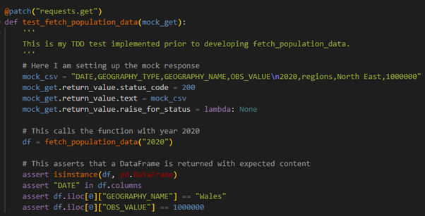
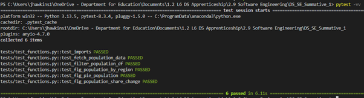

# Data Science Software Engineering Summative 1 Assignment
This repository contains all the files and information relevant to my Summative 1 assignment for the Software Engineering module.

## Project Proposal
The proposal for this project is to create a useful data product. Specifically, this product will use a python file, which connects to the Office for National Statistics (ONS) NOMIS web API to collect UK regional population estimates, and convert this data into three standardised, publication ready charts to be deployed onto Streamlit as an online application. 

The charts selected to be included in this product will be a bar chart displaying the population of each region within the United Kingdom using data from 2023, a pie chart displaying the population breakdown of each region in 2024, and a second bar chart highlighting the percentage change in each region between 2023 and 2024.

The NOMIS API is particularly relevant to my workplace, as colleagues have recently begun to utilise this API and NOMIS datasets. Therefore, this product is highly relevant and may act as an introduction to senior stakeholders and decisions makers about the usefulness and potential of this data.


## Design and Prototype
The NOMIS Population Estimates prototype is available [here]( https://www.figma.com/design/mkHJsps61uHcKIPIVSwEMh/SE_Summative_1?node-id=3-252&t=jPzamB5Tra5ZRfd9-1). 

The initial concept for this application was based on a Tkinter Python application (see Desktop_App page within Figma). This model used four separate frames for the Landing Page, Bar Chart, Pie Chart, and Percentage Change Chart. These pages use an embedded PNG file exported from the Jupyter notebook, including the 2023 Regional Breakdown bar chart, 2024 Regional Breakdown pie chart, and percentage point change in population share from 2023 to 2024. Additionally, each of the buttons within the prototype are wired to allow the user to click through the fully functional prototype.

The design of the original prototype also utilised user feedback. This was captured through a google form containing questions around key design features and was distributed to the five other members within my team. The resulting changes included a rework of the “% Change Chart” name to “Percentage Change Chart”, and a visible button to export/print each page. This contribution helped to integrate user feedback and improved the overall prototype by aligning the prototype more closely with stakeholder expectations and made the application more user-friendly.

However, following further research into the project requirements, the prototype was refocused to reflect a Python Streamlit web application that could be deployed, better representing a realistic software engineering product. The updated design (see Desktop_App_v2 page within Figma) consisted of individual tabs, rather than separate pages, and carried forward the revised labelling and export action, and presented a cleaner, web focused interface. 


An example of the google form used to collect user feedback can be found [here]( https://forms.gle/bS94FHrxhvVtbxLJA).


## Plan
Plan your project using modern planning techinques (Agile with sprints). Use project management tool (GitHub Projects). Add a dedication section to your README that shows how you have used your project management tools.


## Capture
Capture the requirements for your project as issues (aka tickets) accessible via your chosen project management tool.


## Build
Build a minimal viable product (MVP) or prototype step by step, and have a dedicated section in the README that narrates the process.

The final data product can be viewed either be downloaded and run locally (See User Documentation below), or as a deployed Streamlit app [here](https://dssesummative1-hgkh2w98wq8w2go2caj46u.streamlit.app/).

## Test Driven Development
Test-driven development was incorporated throughout this project. All tests are located within the `test_functions.py` file within the testing folder. The testing process began with a simple smoke test to verify that pytest was configured correctly. After this, I created a mock test for the `fetch_population_data`, which retrieves population estimates data using the NOMIS API. This mock test used a predefined CSV text to simulate an API response. This test incorporated test-driven development as it was initially created before the API function was fully developed and was expected to fail. To demonstrate this function, the mock CSV intentionally included the value “North East”, while the assertion checked for “Wales”. This mismatch produced a failure, confirming that the function was not yet complete. Once the function was implemented and the expected value was correct, the test passed, demonstrating successful development under the TDD approach. A screenshot of this mock test can be seen below.



In addition to the main API test, I also implemented several unit tests for the other functions within the `streamlit_app.py` file. This included:
-	A check to see if the `filter_population_df` function correctly transforms the raw NOMIS dataset into a cleaned and standardised format, ready for visualisation.
-	A check for the three chart-generation functions of `test_fig_population_by_region`, `test_fig_pie_population`, and `test_fig_population_share_change`. This aimed to see if each correctly produced a valid Matplotlib figure, to ensure that all visualisation logic worked with predefined data.
Once the the streamlit_app had been fully integrated and pushed to Github, each of the tests ran successfully. A screenshot of these tests can be found below.



Once all my tests have been completed and pushed to GitHub, I created a Continuous Integration / Continuous Deployment (CI/CD) pipeline using Github actions to automate the testing process for future iterations. This pipeline runs the full test file every time new code is committed, or a pull request is made, ensuring that any new additions to the codebase do not break existing functionality. A screenshot of a successful CI/CD pipeline run using GitHub actions can be seen below.


## Iterative Development
Use GitHub or an alternative to add features to your MVP or prototype gradually.


## User Documentation
This section of the project will explain how a user may replicate the Streamlit app to deploy it locally.

### Prerequisities
- Python 3.12.10
- Pip 25.3
  
Verify versions:
```python
python --version
pip --version
```

### Clone the Repository
Clone the repo using the **Code** button at the top of this repository or run:
```python
git clone https://github.com/Jh3345a-work/DS_SE_Summative_1.git
```

### Install Dependencies
Install all required packages from requirements.txt:
```python
pip install -r requirements.txt
```

### Run the Streamlit App
To start the app locally:
```python
streamlit run streamlit_app.py
```
Streamlit will then automatically launch on your browser locally.

### Alternative: Deploy on Streamlit Cloud
Deploy on Streamlit Cloud [here](https://share.streamlit.io/?utm_source=streamlit&utm_medium=referral&utm_campaign=main&utm_content=-ss-streamlit-io-topright) and use the button in the top right of the screen, using the details from this repository.

### Testing
This project also include unit tests to ensure correct functionality. To run the tests:
```python
pytest -vv
```
This will run the each of the tests with a verbose output.


## Maintain
Maintain the ticketing system to keep the documentation up to date. Conventionally, one ticket corresponds to one feature, which in turn corresponds to one branch and one pull request. Bug tickets are documented differently from feature tickets.


## Evaluate
Evaluate your product in a dedicated "Evaluation" section of your README.


# Submission
- Non-anonymous. Submit a link to your GitHub repo, ensuring it is public.
- Additionally, submit a PDF of your REAME in the rooot of the Canvas submission.
- Finally, submit a ZIP folder downloaded from your GitHub repo.
